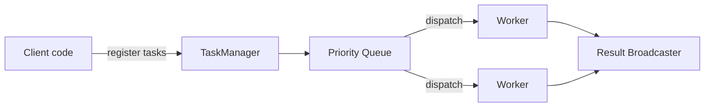

# go-worker

[](https://github.com/hyp3rd/go-worker/actions/workflows/go.yml) [](https://github.com/hyp3rd/go-worker/actions/workflows/codeql.yml) [](https://goreportcard.com/report/github.com/hyp3rd/go-worker) [](https://pkg.go.dev/github.com/hyp3rd/go-worker) [](https://opensource.org/licenses/MIT)

`go-worker` provides a simple way to manage and execute prioritized tasks concurrently, backed by a `TaskManager` with a worker pool and a priority queue.

## Breaking changes (January 2026)

- `Stop()` removed. Use `StopGraceful(ctx)` or `StopNow()`.
- Local result streaming uses `SubscribeResults(buffer)`; `GetResults()` is now a compatibility shim and `StreamResults()` is removed.
- `RegisterTasks` now returns an error.
- `Task.Execute` replaces `Fn` in examples.
- `NewGRPCServer` requires a handler map.
- Rate limiting is deterministic: burst is `min(maxWorkers, maxTasks)` and `ExecuteTask` uses the shared limiter.

## Features

- Task prioritization: tasks are scheduled by priority.
- Concurrent execution: tasks run in a worker pool with strict rate limiting.
- Middleware: wrap the `TaskManager` for logging/metrics, etc.
- Results: fan-out subscriptions via `SubscribeResults`.
- Cancellation: cancel tasks before or during execution.
- Retries: exponential backoff with capped delays.
- Durability: optional Redis-backed durable task queue.

## Architecture



## gRPC Service

`go-worker` exposes its functionality over gRPC through the `WorkerService`.
The service allows clients to register tasks, stream results, cancel running
tasks and query their status.

### Handlers and Payloads

The server registers handlers keyed by name. Each handler consists of a `Make` function that constructs the expected payload type, and a `Fn` function that executes the task logic using the unpacked payload.

Clients send a `Task` message containing a `name` and a serialized `payload` using `google.protobuf.Any`. The server automatically unpacks the `Any` payload into the correct type based on the registered handler and passes it to the corresponding function.

```go
handlers := map[string]worker.HandlerSpec{
    "create_user": {
        Make: func() protoreflect.ProtoMessage { return &workerpb.CreateUserPayload{} },
        Fn: func(ctx context.Context, payload protoreflect.ProtoMessage) (any, error) {
            p := payload.(*workerpb.CreateUserPayload)
            return &workerpb.CreateUserResponse{UserId: "1234"}, nil
        },
    },
}

srv := worker.NewGRPCServer(tm, handlers)
```

For production, configure TLS credentials and interceptors (logging/auth) on the gRPC server; see `__examples/grpc` for a complete setup.

### Authorization hook

You can enforce authentication/authorization at the gRPC boundary with `WithGRPCAuth`.
Return a gRPC status error to control the response code (e.g., `Unauthenticated` or `PermissionDenied`).

```go
auth := func(ctx context.Context, method string, _ any) error {
 md, _ := metadata.FromIncomingContext(ctx)
 values := md.Get("authorization")
 if len(values) == 0 {
  return status.Error(codes.Unauthenticated, "missing token")
 }

 token := strings.TrimSpace(strings.TrimPrefix(values[0], "Bearer "))
 if token != "expected-token" {
  return status.Error(codes.Unauthenticated, "missing or invalid token")
 }

 return nil
}

srv := worker.NewGRPCServer(tm, handlers, worker.WithGRPCAuth(auth))
```

**Note on deadlines:** When the client uses a stream context with a deadline, exceeding the deadline will terminate the stream but **does not cancel the tasks running on the server**. To properly handle cancellation, use separate contexts for task execution or cancel tasks explicitly.

## API Example (gRPC)

```go
tm := worker.NewTaskManagerWithDefaults(context.Background())
handlers := map[string]worker.HandlerSpec{
    "create_user": {
        Make: func() protoreflect.ProtoMessage { return &workerpb.CreateUserPayload{} },
        Fn: func(ctx context.Context, payload protoreflect.ProtoMessage) (any, error) {
            p := payload.(*workerpb.CreateUserPayload)
            return &workerpb.CreateUserResponse{UserId: "1234"}, nil
        },
    },
}

srv := worker.NewGRPCServer(tm, handlers)

gs := grpc.NewServer()
workerpb.RegisterWorkerServiceServer(gs, srv)
// listen and serve ...

client := workerpb.NewWorkerServiceClient(conn)

// register a task with payload
payload, err := anypb.New(&workerpb.CreateUserPayload{
    Username: "newuser",
    Email:    "newuser@example.com",
})
if err != nil {
    log.Fatal(err)
}

_, _ = client.RegisterTasks(ctx, &workerpb.RegisterTasksRequest{
    Tasks: []*workerpb.Task{
        {
            Name:           "create_user",
            Payload:        payload,
            CorrelationId:  uuid.NewString(),
            IdempotencyKey: "create_user:newuser@example.com",
            Metadata:       map[string]string{"source": "api_example", "role": "admin"},
        },
    },
})

// cancel by id
_, _ = client.CancelTask(ctx, &workerpb.CancelTaskRequest{Id: "<task-id>"})

// get task information
res, _ := client.GetTask(ctx, &workerpb.GetTaskRequest{Id: "<task-id>"})
fmt.Println(res.Status)
```

## API Usage Examples

### Quick Start

```go
tm := worker.NewTaskManager(context.Background(), 2, 10, 5, 30*time.Second, time.Second, 3)

task := &worker.Task{
    ID:       uuid.New(),
    Priority: 1,
    Ctx:      context.Background(),
    Execute:  func(ctx context.Context, _ ...any) (any, error) { return "hello", nil },
}

if err := tm.RegisterTask(context.Background(), task); err != nil {
    log.Fatal(err)
}

results, cancel := tm.SubscribeResults(1)
res := <-results
cancel()

fmt.Println(res.Result)
```

### Result backpressure

By default, full subscriber buffers drop new results. You can change the policy:

```go
tm.SetResultsDropPolicy(worker.DropOldest)
```

`GetResults()` remains as a compatibility shim and returns a channel with a default buffer.
Prefer `SubscribeResults(buffer)` so you can control buffering and explicitly unsubscribe.

### Initialization

Create a new `TaskManager` by calling the `NewTaskManager()` function with the following parameters:

- `ctx` is the base context for the task manager (used for shutdown and derived task contexts)
- `maxWorkers` is the number of workers to start. If <= 0, it will default to the number of available CPUs
- `maxTasks` is the maximum number of queued tasks, defaults to 10
- `tasksPerSecond` is the rate limit of tasks that can be executed per second. If <= 0, rate limiting is disabled
  (the limiter uses a burst size of `min(maxWorkers, maxTasks)` for deterministic throttling)
- `timeout` is the default timeout for tasks, defaults to 5 minutes
- `retryDelay` is the default delay between retries, defaults to 1 second
- `maxRetries` is the default maximum number of retries, defaults to 3 (0 disables retries)

```go
tm := worker.NewTaskManager(context.Background(), 4, 10, 5, 30*time.Second, 1*time.Second, 3)
```

### Durable backend (Redis)

Durable tasks use a separate `DurableTask` type and a handler registry keyed by name.
The default encoding is protobuf via `ProtoDurableCodec`. When a durable backend is enabled,
`RegisterTask`/`RegisterTasks` are disabled in favor of `RegisterDurableTask(s)`.

```go
client, err := rueidis.NewClient(rueidis.ClientOption{
    InitAddress: []string{"127.0.0.1:6379"},
})
if err != nil {
    log.Fatal(err)
}
defer client.Close()

backend, err := worker.NewRedisDurableBackend(client)
if err != nil {
    log.Fatal(err)
}

handlers := map[string]worker.DurableHandlerSpec{
    "send_email": {
        Make: func() proto.Message { return &workerpb.SendEmailRequest{} },
        Fn: func(ctx context.Context, payload proto.Message) (any, error) {
            req := payload.(*workerpb.SendEmailRequest)
            // process request
            return &workerpb.SendEmailResponse{MessageId: "msg-1"}, nil
        },
    },
}

tm := worker.NewTaskManagerWithOptions(
    context.Background(),
    worker.WithDurableBackend(backend),
    worker.WithDurableHandlers(handlers),
)

err = tm.RegisterDurableTask(context.Background(), worker.DurableTask{
    Handler: "send_email",
    Message: &workerpb.SendEmailRequest{To: "ops@example.com"},
    Retries: 5,
})
if err != nil {
    log.Fatal(err)
}
```

Optional retention can be configured to prevent unbounded task registry growth:

```go
tm.SetRetentionPolicy(worker.RetentionPolicy{
    TTL:        24 * time.Hour,
    MaxEntries: 100000,
})
```

Retention applies only to terminal tasks (completed/failed/cancelled/etc). Running or queued tasks are never evicted.
Cleanup is best-effort: it runs on task completion and periodically when `TTL > 0`.
If `CleanupInterval` is unset, the default interval is `clamp(TTL/2, 1s, 1m)`.
If `MaxEntries` is lower than the number of active tasks, the registry may exceed the limit until tasks finish.

Task lifecycle hooks can be configured for structured logging or tracing:

```go
tm.SetHooks(worker.TaskHooks{
    OnQueued: func(task *worker.Task) {
        // log enqueue
    },
    OnStart: func(task *worker.Task) {
        // log start
    },
    OnFinish: func(task *worker.Task, status worker.TaskStatus, _ any, err error) {
        // log completion
        _ = err
        _ = status
    },
})
```

Tracing hooks can be configured with a tracer implementation:

```go
tm.SetTracer(myTracer)
```

See `__examples/tracing` for a minimal logger-based tracer.
See `__examples/otel_tracing` for OpenTelemetry tracing with a stdout exporter.

### OpenTelemetry metrics

To export metrics with OpenTelemetry, configure a meter provider and pass it to the task manager:

```go
exporter, err := stdoutmetric.New(stdoutmetric.WithPrettyPrint())
if err != nil {
    log.Fatal(err)
}

reader := sdkmetric.NewPeriodicReader(exporter)
mp := sdkmetric.NewMeterProvider(sdkmetric.WithReader(reader))
defer func() {
    _ = mp.Shutdown(context.Background())
}()

if err := tm.SetMeterProvider(mp); err != nil {
    log.Fatal(err)
}
```

See `__examples/otel_metrics` for a complete runnable example.
See `__examples/otel_metrics_otlp` for an OTLP/HTTP exporter example.

Emitted metrics:

- `tasks_scheduled_total`
- `tasks_running`
- `tasks_completed_total`
- `tasks_failed_total`
- `tasks_cancelled_total`
- `tasks_retried_total`
- `results_dropped_total`
- `queue_depth`
- `task_latency_seconds`

### Registering Tasks

Register new tasks by calling the `RegisterTasks()` method of the `TaskManager` struct and passing in a variadic number of tasks.

```go
id := uuid.New()

task := &worker.Task{
    ID:          id,
    Name:        "Some task",
    Description: "Here goes the description of the task",
    Priority:    10,
    Ctx:         context.Background(),
    Execute: func(ctx context.Context, _ ...any) (any, error) {
        time.Sleep(time.Second)
        return fmt.Sprintf("task %s executed", id), nil
    },
    Retries:    3,
    RetryDelay: 2 * time.Second,
}

task2 := &worker.Task{
    ID:       uuid.New(),
    Priority: 10,
    Ctx:      context.Background(),
    Execute:  func(ctx context.Context, _ ...any) (any, error) { return "Hello, World!", nil },
}

if err := tm.RegisterTasks(context.Background(), task, task2); err != nil {
    log.Fatal(err)
}
```

### Stopping the Task Manager

Use `StopGraceful` to stop accepting new tasks and wait for completion, or `StopNow` to cancel tasks immediately.

```go
ctx, cancel := context.WithTimeout(context.Background(), 5*time.Second)
defer cancel()

_ = tm.StopGraceful(ctx)
// or
// tm.StopNow()
```

### Results

Subscribe to results with a dedicated channel per subscriber.

```go
results, cancel := tm.SubscribeResults(10)

ctx, cancelWait := context.WithTimeout(context.Background(), 5*time.Second)
defer cancelWait()

_ = tm.Wait(ctx)
cancel()

for res := range results {
    fmt.Println(res)
}
```

### Cancellation

You can cancel a `Task` by calling the `CancelTask()` method of the `TaskManager` struct and passing in the task ID as a parameter.

```go
_ = tm.CancelTask(task.ID)
```

You can cancel all tasks by calling the `CancelAll()` method of the `TaskManager` struct.

```go
tm.CancelAll()
```

### Middleware

You can apply middleware to the `TaskManager` by calling the `RegisterMiddleware()` function and passing in the `TaskManager` and the middleware functions.

```go
srv := worker.RegisterMiddleware[worker.Service](tm,
    func(next worker.Service) worker.Service {
        return middleware.NewLoggerMiddleware(next, logger)
    },
)
```

### Example

```go
package main

import (
    "context"
    "fmt"
    "time"

    "github.com/google/uuid"
    worker "github.com/hyp3rd/go-worker"
    "github.com/hyp3rd/go-worker/middleware"
)

func main() {
    tm := worker.NewTaskManager(context.Background(), 4, 10, 5, 3*time.Second, 30*time.Second, 3)

    var srv worker.Service = worker.RegisterMiddleware[worker.Service](tm,
        func(next worker.Service) worker.Service {
            return middleware.NewLoggerMiddleware(next, middleware.DefaultLogger())
        },
    )

    task := &worker.Task{
        ID:       uuid.New(),
        Priority: 1,
        Ctx:      context.Background(),
        Execute: func(ctx context.Context, _ ...any) (any, error) {
            return 2 + 5, nil
        },
    }

    _ = srv.RegisterTasks(context.Background(), task)

    results, cancel := srv.SubscribeResults(10)
    defer cancel()

    ctx, cancelWait := context.WithTimeout(context.Background(), 5*time.Second)
    defer cancelWait()
    _ = srv.Wait(ctx)

    for res := range results {
        fmt.Println(res)
    }
}
```

## Versioning

This project follows [Semantic Versioning](https://semver.org/).

## Contribution Guidelines

We welcome contributions! Fork the repository, create a feature branch, run the linters and tests, then open a pull request.

### Feature Requests

To propose new ideas, open an issue using the *Feature request* template.

### Newcomer-Friendly Issues

Issues labeled `good first issue` or `help wanted` are ideal starting points for new contributors.

## Release Notes

See [CHANGELOG](CHANGELOG.md) for the history of released versions.

## License

This project is licensed under the MIT License - see the [LICENSE](LICENSE) file for details.
