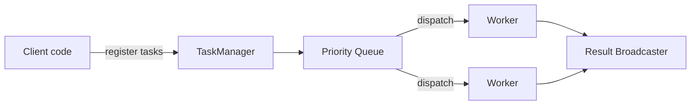

# go-worker

[](https://github.com/hyp3rd/go-worker/actions/workflows/go.yml) [](https://github.com/hyp3rd/go-worker/actions/workflows/codeql.yml) [](https://goreportcard.com/report/github.com/hyp3rd/go-worker) [](https://pkg.go.dev/github.com/hyp3rd/go-worker) [](https://opensource.org/licenses/MIT)

`go-worker` provides a simple way to manage and execute prioritized tasks concurrently, backed by a `TaskManager` with a worker pool and a priority queue.

## Breaking changes (January 2026)

- `Stop()` removed. Use `StopGraceful(ctx)` or `StopNow()`.
- Local result streaming uses `SubscribeResults(buffer)`; `GetResults()` is now a compatibility shim and the legacy local `StreamResults()` is removed (gRPC `StreamResults` remains).
- `RegisterTasks` now returns an error.
- `Task.Execute` replaces `Fn` in examples.
- `NewGRPCServer` requires a handler map.
- Rate limiting is deterministic: burst is `min(maxWorkers, maxTasks)` and `ExecuteTask` uses the shared limiter.
- gRPC durable tasks use `RegisterDurableTasks` and the new `DurableTask` message.
- When a durable backend is configured, use `RegisterDurableTask(s)` instead of `RegisterTask(s)`.
- `DurableBackend` now requires `Extend` (lease renewal support for custom backends).

## Features

- Task prioritization: tasks are scheduled by priority.
- Concurrent execution: tasks run in a worker pool with strict rate limiting.
- Middleware: wrap the `TaskManager` for logging/metrics, etc.
- Results: fan-out subscriptions via `SubscribeResults`.
- Cancellation: cancel tasks before or during execution.
- Retries: exponential backoff with capped delays.
- Durability: optional Redis-backed durable task queue (at-least-once, lease-based).

## Architecture



## gRPC Service

`go-worker` exposes its functionality over gRPC through the `WorkerService`.
The service allows clients to register tasks, stream results, cancel running
tasks and query their status.

### Handlers and Payloads

The server registers handlers keyed by name. Each handler consists of a `Make` function that constructs the expected payload type, and a `Fn` function that executes the task logic using the unpacked payload.

Clients send a `Task` message containing a `name` and a serialized `payload` using `google.protobuf.Any`. The server automatically unpacks the `Any` payload into the correct type based on the registered handler and passes it to the corresponding function. For durable tasks, use `RegisterDurableTasks` with the `DurableTask` message (the payload is still an `Any`).

```go
handlers := map[string]worker.HandlerSpec{
    "create_user": {
        Make: func() protoreflect.ProtoMessage { return &workerpb.CreateUserPayload{} },
        Fn: func(ctx context.Context, payload protoreflect.ProtoMessage) (any, error) {
            p := payload.(*workerpb.CreateUserPayload)
            return &workerpb.CreateUserResponse{UserId: "1234"}, nil
        },
    },
}

srv := worker.NewGRPCServer(tm, handlers)
```

For production, configure TLS credentials and interceptors (logging/auth) on the gRPC server; see `__examples/grpc` for a complete setup.
For a Redis-backed durable gRPC example, see `__examples/grpc_durable`.

Queue selection for gRPC tasks is done via metadata (`worker.MetadataQueueKey`, `worker.MetadataWeightKey`):

- `queue`: named queue (empty means `default`)
- `weight`: integer weight (as string)

Security defaults to follow in production:

- Use TLS (prefer mTLS) for gRPC; the durable gRPC example uses insecure credentials for local demos only.
- Scrub payloads and auth metadata from logs; log task IDs or correlation IDs instead of PII.
- Implement auth via `WithGRPCAuth` and redact/validate tokens inside interceptors.

### Typed handler registry (optional)

For compile-time payload checks in handlers, use the typed registry. It removes the need for payload type assertions inside your handler functions.

```go
registry := worker.NewTypedHandlerRegistry()
_ = worker.AddTypedHandler(registry, "create_user", worker.TypedHandlerSpec[*workerpb.CreateUserPayload]{
    Make: func() *workerpb.CreateUserPayload { return &workerpb.CreateUserPayload{} },
    Fn: func(ctx context.Context, payload *workerpb.CreateUserPayload) (any, error) {
        return &workerpb.CreateUserResponse{UserId: "1234"}, nil
    },
})

srv := worker.NewGRPCServer(tm, registry.Handlers())
```

### Durable gRPC client (example)

Use `RegisterDurableTasks` for persisted tasks (payload is still `Any`). Results stream is shared with non-durable tasks.

```go
payload, _ := anypb.New(&workerpb.SendEmailPayload{
    To:      "ops@example.com",
    Subject: "Hello durable gRPC",
    Body:    "Persisted task",
})

resp, err := client.RegisterDurableTasks(ctx, &workerpb.RegisterDurableTasksRequest{
    Tasks: []*workerpb.DurableTask{
        {
            Name:           "send_email",
            Payload:        payload,
            IdempotencyKey: "durable:send_email:ops@example.com",
        },
    },
})
if err != nil {
    log.Fatal(err)
}
```

### Authorization hook

You can enforce authentication/authorization at the gRPC boundary with `WithGRPCAuth`.
Return a gRPC status error to control the response code (e.g., `Unauthenticated` or `PermissionDenied`).

```go
auth := func(ctx context.Context, method string, _ any) error {
 md, _ := metadata.FromIncomingContext(ctx)
 values := md.Get("authorization")
 if len(values) == 0 {
  return status.Error(codes.Unauthenticated, "missing token")
 }

 token := strings.TrimSpace(strings.TrimPrefix(values[0], "Bearer "))
 if token != "expected-token" {
  return status.Error(codes.Unauthenticated, "missing or invalid token")
 }

 return nil
}

srv := worker.NewGRPCServer(tm, handlers, worker.WithGRPCAuth(auth))
```

**Note on deadlines:** When the client uses a stream context with a deadline, exceeding the deadline will terminate the stream but **does not cancel the tasks running on the server**. To properly handle cancellation, use separate contexts for task execution or cancel tasks explicitly.

## API Example (gRPC)

```go
tm := worker.NewTaskManagerWithDefaults(context.Background())
handlers := map[string]worker.HandlerSpec{
    "create_user": {
        Make: func() protoreflect.ProtoMessage { return &workerpb.CreateUserPayload{} },
        Fn: func(ctx context.Context, payload protoreflect.ProtoMessage) (any, error) {
            p := payload.(*workerpb.CreateUserPayload)
            return &workerpb.CreateUserResponse{UserId: "1234"}, nil
        },
    },
}

srv := worker.NewGRPCServer(tm, handlers)

gs := grpc.NewServer()
workerpb.RegisterWorkerServiceServer(gs, srv)
// listen and serve ...

client := workerpb.NewWorkerServiceClient(conn)

// register a task with payload
payload, err := anypb.New(&workerpb.CreateUserPayload{
    Username: "newuser",
    Email:    "newuser@example.com",
})
if err != nil {
    log.Fatal(err)
}

_, _ = client.RegisterTasks(ctx, &workerpb.RegisterTasksRequest{
    Tasks: []*workerpb.Task{
        {
            Name:           "create_user",
            Payload:        payload,
            CorrelationId:  uuid.NewString(),
            IdempotencyKey: "create_user:newuser@example.com",
            Metadata:       map[string]string{"source": "api_example", "role": "admin"},
        },
    },
})

// cancel by id
_, _ = client.CancelTask(ctx, &workerpb.CancelTaskRequest{Id: "<task-id>"})

// get task information
res, _ := client.GetTask(ctx, &workerpb.GetTaskRequest{Id: "<task-id>"})
fmt.Println(res.Status)
```

## API Usage Examples

### Quick Start

```go
tm := worker.NewTaskManager(context.Background(), 2, 10, 5, 30*time.Second, time.Second, 3)

task := &worker.Task{
    ID:       uuid.New(),
    Priority: 1,
    Ctx:      context.Background(),
    Execute:  func(ctx context.Context, _ ...any) (any, error) { return "hello", nil },
}

if err := tm.RegisterTask(context.Background(), task); err != nil {
    log.Fatal(err)
}

results, cancel := tm.SubscribeResults(1)
res := <-results
cancel()

fmt.Println(res.Result)
```

### Result backpressure

By default, full subscriber buffers drop new results. You can change the policy:

```go
tm.SetResultsDropPolicy(worker.DropOldest)
```

`GetResults()` remains as a compatibility shim and returns a channel with a default buffer.
Prefer `SubscribeResults(buffer)` so you can control buffering and explicitly unsubscribe.

### Initialization

Create a new `TaskManager` by calling the `NewTaskManager()` function with the following parameters:

- `ctx` is the base context for the task manager (used for shutdown and derived task contexts)
- `maxWorkers` is the number of workers to start. If <= 0, it will default to the number of available CPUs
- `maxTasks` is the maximum number of queued tasks, defaults to 10
- `tasksPerSecond` is the rate limit of tasks that can be executed per second. If <= 0, rate limiting is disabled
  (the limiter uses a burst size of `min(maxWorkers, maxTasks)` for deterministic throttling)
- `timeout` is the default timeout for tasks, defaults to 5 minutes
- `retryDelay` is the default delay between retries, defaults to 1 second
- `maxRetries` is the default maximum number of retries, defaults to 3 (0 disables retries)

```go
tm := worker.NewTaskManager(context.Background(), 4, 10, 5, 30*time.Second, 1*time.Second, 3)
```

### Durable backend (Redis)

Durable tasks use a separate `DurableTask` type and a handler registry keyed by name.
The default encoding is protobuf via `ProtoDurableCodec`. When a durable backend is enabled,
`RegisterTask`/`RegisterTasks` are disabled in favor of `RegisterDurableTask(s)`.
See `__examples/durable_redis` for a runnable example.

```go
client, err := rueidis.NewClient(rueidis.ClientOption{
    InitAddress: []string{"127.0.0.1:6379"},
})
if err != nil {
    log.Fatal(err)
}
defer client.Close()

backend, err := worker.NewRedisDurableBackend(client)
if err != nil {
    log.Fatal(err)
}

handlers := map[string]worker.DurableHandlerSpec{
    "send_email": {
        Make: func() proto.Message { return &workerpb.SendEmailRequest{} },
        Fn: func(ctx context.Context, payload proto.Message) (any, error) {
            req := payload.(*workerpb.SendEmailRequest)
            // process request
            return &workerpb.SendEmailResponse{MessageId: "msg-1"}, nil
        },
    },
}

tm := worker.NewTaskManagerWithOptions(
    context.Background(),
    worker.WithDurableBackend(backend),
    worker.WithDurableHandlers(handlers),
)

err = tm.RegisterDurableTask(context.Background(), worker.DurableTask{
    Handler: "send_email",
    Message: &workerpb.SendEmailRequest{To: "ops@example.com"},
    Retries: 5,
    Queue:   "email",
    Weight:  2,
})
if err != nil {
    log.Fatal(err)
}
```

Or use the typed durable registry for compile-time checks:

```go
durableRegistry := worker.NewTypedDurableRegistry()
_ = worker.AddTypedDurableHandler(durableRegistry, "send_email", worker.TypedDurableHandlerSpec[*workerpb.SendEmailRequest]{
    Make: func() *workerpb.SendEmailRequest { return &workerpb.SendEmailRequest{} },
    Fn: func(ctx context.Context, payload *workerpb.SendEmailRequest) (any, error) {
        // process request
        return &workerpb.SendEmailResponse{MessageId: "msg-1"}, nil
    },
})

tm := worker.NewTaskManagerWithOptions(
    context.Background(),
    worker.WithDurableBackend(backend),
    worker.WithDurableHandlers(durableRegistry.Handlers()),
)
```

Defaults: lease is 30s, poll interval is 200ms, Redis dequeue batch is 50, and lease renewal is disabled (configurable via options).
Queue weights for durable tasks can be configured with `WithRedisDurableQueueWeights`, and the default queue via `WithRedisDurableDefaultQueue`.

Operational notes (durable Redis):

- **Key hashing**: Redis Lua scripts touch multiple keys; for clustered Redis, all keys must share the same hash slot. The backend auto-wraps the prefix in `{}` to enforce this (e.g., `{go-worker}:ready`).
- **DLQ**: Failed tasks are pushed to a dead-letter list (`{prefix}:dead`).
- **DLQ replay**: Use the `workerctl durable dlq replay` command or the `__examples/durable_dlq_replay` utility (dry-run by default; use `--apply`/`-apply` to replay).
- **Multi-node workers**: Multiple workers can safely dequeue from the same backend. Lease timeouts handle worker crashes, but tune `WithDurableLease` for your workload.
- **Lease renewal**: enable `WithDurableLeaseRenewalInterval` for long-running tasks to extend leases while a task executes.
- **Visibility**: Ready/processing queues live in per-queue sorted sets: `{prefix}:ready:<queue>` and `{prefix}:processing:<queue>`. Known queues are tracked in `{prefix}:queues`.
- **Inspect utility**: `workerctl durable inspect` (or `__examples/durable_queue_inspect`) prints ready/processing/dead counts; use `--show-ids --queue=<name>` (or `-show-ids -queue=<name>`) to display IDs.

### CLI tooling (workerctl)

Build the CLI:

```bash
go build -o workerctl ./cmd/workerctl
```

Inspect queues:

```bash
./workerctl durable inspect --redis-addr localhost:6380 --redis-password supersecret --redis-prefix go-worker --queue default --show-ids --peek 10
```

List queues:

```bash
./workerctl durable queues --with-counts
```

Requeue specific tasks by ID:

```bash
./workerctl durable retry --id 8c0f8b2d-0a4d-4a3b-9ad7-2d2a5b7f5d12 --apply
```

Requeue tasks from a source set (DLQ/ready/processing):

```bash
./workerctl durable retry --source dlq --limit 100 --apply
./workerctl durable retry --source ready --from-queue default --limit 50 --apply
```

Requeue a queue directly (shortcut):

```bash
./workerctl durable requeue --queue default --limit 50 --apply
```

Fetch a task by ID:

```bash
./workerctl durable get --id 8c0f8b2d-0a4d-4a3b-9ad7-2d2a5b7f5d12
```

Enqueue a durable task from JSON/YAML payload:

```bash
./workerctl durable enqueue --handler send_email --queue default --payload '{"to":"ops@example.com","subject":"Hello","body":"Hi"}' --apply
./workerctl durable enqueue --handler send_email --payload-file payload.yaml --payload-format yaml --apply
./workerctl durable enqueue --handler send_email --payload-b64 "$(base64 -w0 payload.bin)" --apply
```

Note: the payload is stored as raw bytes. JSON/YAML are encoded to JSON bytes. Make sure the bytes match your durable codec (default is protobuf).

Delete a task (and optionally its hash):

```bash
./workerctl durable delete --id 8c0f8b2d-0a4d-4a3b-9ad7-2d2a5b7f5d12 --apply
./workerctl durable delete --id 8c0f8b2d-0a4d-4a3b-9ad7-2d2a5b7f5d12 --delete-hash --apply
```

Show stats in JSON:

```bash
./workerctl durable stats --json
./workerctl durable stats --watch 2s
```

Pause/resume durable dequeue:

```bash
./workerctl durable pause --apply
./workerctl durable resume --apply
./workerctl durable paused
```

Purge queues (use with care):

```bash
./workerctl durable purge --ready --processing --queue default --apply
```

Dump task metadata (JSON lines, no payloads):

```bash
./workerctl durable dump --queue default --ready --limit 100 > dump.jsonl
```

Export/import queue snapshots (JSONL):

```bash
./workerctl durable snapshot export --out snapshot.jsonl --ready --processing --dlq
./workerctl durable snapshot import --in snapshot.jsonl --apply
```

Replay DLQ items (dry-run by default):

```bash
./workerctl durable dlq replay --batch 100 --apply
```

Use `--tls` (and `--tls-insecure` if needed) for secure Redis connections.

Generate shell completion:

```bash
./workerctl completion zsh > "${fpath[1]}/_workerctl"
```

### Multi-node coordination (durable Redis)

Durable processing is **at-least-once**. When multiple nodes consume from the same Redis backend:

- **Lease sizing**: set `WithDurableLease` longer than your worst-case task duration (plus buffer). If a task exceeds its lease, it can be requeued and run again on another node.
- **Lease renewal (optional)**: set `WithDurableLeaseRenewalInterval` (less than the lease duration) to extend leases while tasks run.
- **Idempotency**: enforce idempotency at the task level (idempotency key + handler-side dedupe) because duplicates are possible on retries and lease expiry.
- **Throughput control**: worker count and polling interval are per node. If you need a **global** rate limit across nodes, enforce it externally or in the handler.
- **Clock skew**: Redis uses server time for scores; keep node clocks in sync to avoid uneven dequeue/lease timing.
- **Isolation**: use distinct prefixes per environment/region/tenant to avoid cross-talk.

Checklist:

- Set `WithDurableLease` above p99 task duration (plus buffer).
- Enable `WithDurableLeaseRenewalInterval` for tasks that can exceed the lease duration.
- Keep task handlers idempotent; always use idempotency keys for external side effects.
- Tune `WithDurablePollInterval` based on desired responsiveness vs. Redis load.
- Scale `WithMaxWorkers` per node based on CPU and downstream throughput.

Example:

```bash
go run __examples/durable_queue_inspect/main.go -redis-addr=localhost:6380 -redis-password=supersecret -redis-prefix=go-worker
go run __examples/durable_queue_inspect/main.go -redis-addr=localhost:6380 -redis-password=supersecret -redis-prefix=go-worker -queue=default -show-ids -peek=5
```

Sample output:

```shell
queue=default ready=3 processing=1
ready=3 processing=1 dead=0
ready IDs: 8c0f8b2d-0a4d-4a3b-9ad7-2d2a5b7f5d12, 9b18d5f2-3b7f-4d7a-9dd1-1bb1a3a56c55
```

DLQ replay example (dry-run by default):

```bash
go run __examples/durable_dlq_replay/main.go -redis-addr=localhost:6380 -redis-password=supersecret -redis-prefix=go-worker -batch=100
go run __examples/durable_dlq_replay/main.go -redis-addr=localhost:6380 -redis-password=supersecret -redis-prefix=go-worker -batch=100 -apply
```

Optional retention can be configured to prevent unbounded task registry growth:

```go
tm.SetRetentionPolicy(worker.RetentionPolicy{
    TTL:        24 * time.Hour,
    MaxEntries: 100000,
})
```

Retention applies only to terminal tasks (completed/failed/cancelled/etc). Running or queued tasks are never evicted.
Cleanup is best-effort: it runs on task completion and periodically when `TTL > 0`.
If `CleanupInterval` is unset, the default interval is `clamp(TTL/2, 1s, 1m)`.
If `MaxEntries` is lower than the number of active tasks, the registry may exceed the limit until tasks finish.

Task lifecycle hooks can be configured for structured logging or tracing:

```go
tm.SetHooks(worker.TaskHooks{
    OnQueued: func(task *worker.Task) {
        // log enqueue
    },
    OnStart: func(task *worker.Task) {
        // log start
    },
    OnFinish: func(task *worker.Task, status worker.TaskStatus, _ any, err error) {
        // log completion
        _ = err
        _ = status
    },
})
```

Tracing hooks can be configured with a tracer implementation:

```go
tm.SetTracer(myTracer)
```

See `__examples/tracing` for a minimal logger-based tracer.
See `__examples/otel_tracing` for OpenTelemetry tracing with a stdout exporter.

### OpenTelemetry metrics

To export metrics with OpenTelemetry, configure a meter provider and pass it to the task manager:

```go
exporter, err := stdoutmetric.New(stdoutmetric.WithPrettyPrint())
if err != nil {
    log.Fatal(err)
}

reader := sdkmetric.NewPeriodicReader(exporter)
mp := sdkmetric.NewMeterProvider(sdkmetric.WithReader(reader))
defer func() {
    _ = mp.Shutdown(context.Background())
}()

if err := tm.SetMeterProvider(mp); err != nil {
    log.Fatal(err)
}
```

See `__examples/otel_metrics` for a complete runnable example.
See `__examples/otel_metrics_otlp` for an OTLP/HTTP exporter example.

Emitted metrics:

- `tasks_scheduled_total`
- `tasks_running`
- `tasks_completed_total`
- `tasks_failed_total`
- `tasks_cancelled_total`
- `tasks_retried_total`
- `results_dropped_total`
- `queue_depth`
- `task_latency_seconds`

### Registering Tasks

Register new tasks by calling the `RegisterTasks()` method of the `TaskManager` struct and passing in a variadic number of tasks.

```go
id := uuid.New()

task := &worker.Task{
    ID:          id,
    Name:        "Some task",
    Description: "Here goes the description of the task",
    Priority:    10,
    Queue:       "critical",
    Weight:      2,
    Ctx:         context.Background(),
    Execute: func(ctx context.Context, _ ...any) (any, error) {
        time.Sleep(time.Second)
        return fmt.Sprintf("task %s executed", id), nil
    },
    Retries:    3,
    RetryDelay: 2 * time.Second,
}

task2 := &worker.Task{
    ID:       uuid.New(),
    Priority: 10,
    Queue:    "default",
    Weight:   1,
    Ctx:      context.Background(),
    Execute:  func(ctx context.Context, _ ...any) (any, error) { return "Hello, World!", nil },
}

if err := tm.RegisterTasks(context.Background(), task, task2); err != nil {
    log.Fatal(err)
}
```

Queues and weights:

- `Queue` groups tasks for scheduling. Empty means `default`.
- `Weight` is a per-task scheduling hint within a queue (higher weight runs earlier among equal priorities).
- Queue weights control inter-queue share via `WithQueueWeights`; change the default queue via `WithDefaultQueue`.

For gRPC, set `metadata["queue"]` and `metadata["weight"]` (string) on `Task`/`DurableTask`.

### Scheduling Tasks

Schedule tasks for later execution with `RunAt`, `RegisterTaskAt`, or `RegisterTaskAfter`.

```go
task, _ := worker.NewTask(context.Background(), func(ctx context.Context, _ ...any) (any, error) {
    return "delayed", nil
})

_ = tm.RegisterTaskAt(context.Background(), task, time.Now().Add(30*time.Second))
// or
_ = tm.RegisterTaskAfter(context.Background(), task, 30*time.Second)
```

Durable tasks can also be delayed by setting `RunAt` before `RegisterDurableTask`.

### Stopping the Task Manager

Use `StopGraceful` to stop accepting new tasks and wait for completion, or `StopNow` to cancel tasks immediately.

```go
ctx, cancel := context.WithTimeout(context.Background(), 5*time.Second)
defer cancel()

_ = tm.StopGraceful(ctx)
// or
// tm.StopNow()
```

### Results

Subscribe to results with a dedicated channel per subscriber.

```go
results, cancel := tm.SubscribeResults(10)

ctx, cancelWait := context.WithTimeout(context.Background(), 5*time.Second)
defer cancelWait()

_ = tm.Wait(ctx)
cancel()

for res := range results {
    fmt.Println(res)
}
```

### Cancellation

You can cancel a `Task` by calling the `CancelTask()` method of the `TaskManager` struct and passing in the task ID as a parameter.

```go
_ = tm.CancelTask(task.ID)
```

You can cancel all tasks by calling the `CancelAll()` method of the `TaskManager` struct.

```go
tm.CancelAll()
```

### Middleware

You can apply middleware to the `TaskManager` by calling the `RegisterMiddleware()` function and passing in the `TaskManager` and the middleware functions.

```go
srv := worker.RegisterMiddleware[worker.Service](tm,
    func(next worker.Service) worker.Service {
        return middleware.NewLoggerMiddleware(next, logger)
    },
)
```

### Example

```go
package main

import (
    "context"
    "fmt"
    "time"

    "github.com/google/uuid"
    worker "github.com/hyp3rd/go-worker"
    "github.com/hyp3rd/go-worker/middleware"
)

func main() {
    tm := worker.NewTaskManager(context.Background(), 4, 10, 5, 3*time.Second, 30*time.Second, 3)

    var srv worker.Service = worker.RegisterMiddleware[worker.Service](tm,
        func(next worker.Service) worker.Service {
            return middleware.NewLoggerMiddleware(next, middleware.DefaultLogger())
        },
    )

    task := &worker.Task{
        ID:       uuid.New(),
        Priority: 1,
        Ctx:      context.Background(),
        Execute: func(ctx context.Context, _ ...any) (any, error) {
            return 2 + 5, nil
        },
    }

    _ = srv.RegisterTasks(context.Background(), task)

    results, cancel := srv.SubscribeResults(10)
    defer cancel()

    ctx, cancelWait := context.WithTimeout(context.Background(), 5*time.Second)
    defer cancelWait()
    _ = srv.Wait(ctx)

    for res := range results {
        fmt.Println(res)
    }
}
```

## Versioning

This project follows [Semantic Versioning](https://semver.org/).

## Contribution Guidelines

We welcome contributions! Fork the repository, create a feature branch, run the linters and tests, then open a pull request.

### Feature Requests

To propose new ideas, open an issue using the *Feature request* template.

### Newcomer-Friendly Issues

Issues labeled `good first issue` or `help wanted` are ideal starting points for new contributors.

## Release Notes

See [CHANGELOG](CHANGELOG.md) for the history of released versions.

## License

This project is licensed under the MIT License - see the [LICENSE](LICENSE) file for details.
